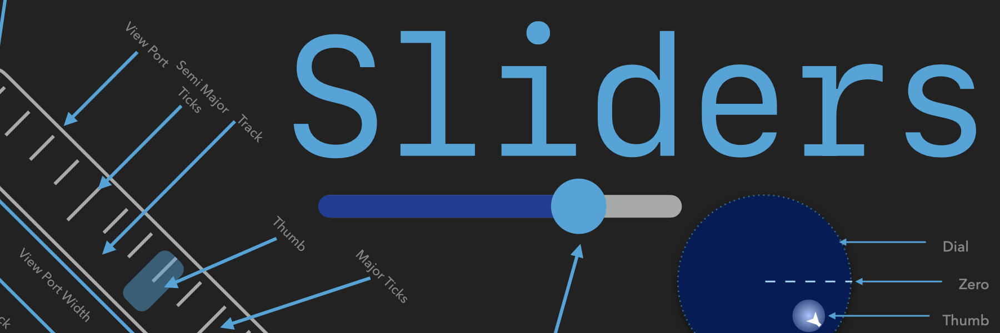

<p align="center">
    
</p>

<p align="center">
    
    
    
    
</p>

**Sliders** is a compilation of all my stylable drag based SwiftUI components. It provides a variety of unique controls as well as an enhanced version of the normal `Slider` called an `LSlider`. You can try them all out quickly by clone the example [project](https://github.com/kieranb662/SlidersExamples)

<p align="center">
    
</p>


The various components are: 
* `LSlider` - a spatially adaptive slider that fits to its container at any angle you decide.
* `RSlider` - A circularly shaped slider which restricts movement of the thumb to the radius of the circle 
* `PSlider` - Turn any `Shape` into its very own slider!
* `OverflowSlider` - A meter like slider which has two moving components, the track and the thumb. Also has velocity based gestures implemented 
* `TrackPad` - A 2D version of a normal slider, which restricts displacement of the thumb to the bounds of the track 
* `RadialPad` - A joystick like component that does not reset the position of the thumb upon gesture end. 
* `Joystick` - an onscreen joystick that can appear anywhere the user drags within the defined hitbox, if the drag ends inside the lockbox, the joystick remains onscreen locked in the forward position. if the drag ends **not** inside the lockbox the joystick fades away until the hitbox is dragged again.


## Requirements 

**Sliders** as a default requires the SwiftUI Framework to be operational and since the `DragGesture` is required only these platforms can make use of the library:

* macOS 10.15 or Greater 
* iOS 13 or Greater 
* watchOS 6 or Greater

## How To Add To Your Project

1. Snag that URL from the github repo 
2. In Xcode -> File -> Swift Packages -> Add Package Dependencies 
3. Paste the URL Into the box
4. Specify the minimum version number (This is new so 1.0.3 and greater will work).

## Dependencies 

* [CGExtender](https://github.com/kieranb662/CGExtender)
* [Shapes](https://github.com/kieranb662/Shapes) - Currently looking for contributors 
* [bez](https://github.com/kieranb662/bez)

## LSlider

### Spatially Adaptive Linear Slider

 While at on the surface this slider my seem like a copy of the already available `Slider`. I implore you to try and make a neat layout with a `Slider` in the vertical position.
 After trying everything with SwiftUI's built in slider I realized making layouts with it just was not going to work. So I created the `LSlider`. It works just like a normal `Slider` except
 You can provide a value for the angle parameter which rotates the slider and adaptively fits it to its containing view. Also Its fully customizable with cascading styles thanks to Environment variables.

 - **parameters**:
     - `value`: `Binding<Double>` The value the slider should control
     - `range`: `ClosedRange<Double>` The minimum and maximum numbers that `value` can be
     - `angle`: `Angle` The angle you would like the slider to be at
     - `isDisabled`: `Bool` Whether or not the slider should be disabled

### Styling The Slider

 To create a custom style for the slider you need to create a `LSliderStyle` conforming struct. Conformance requires implementation of 2 methods
 
 1. `makeThumb`: which creates the draggable portion of the slider
 2. `makeTrack`: which creates the track which fills or empties as the thumb is dragging within it

 Both methods provide access to the sliders current state thru the `LSliderConfiguration` of the `LSlider `to be styled

````Swift
        struct LSliderConfiguration {
            let isDisabled: Bool // whether or not the slider is current disables
            let isActive: Bool // whether or not the thumb is dragging or not
            let pctFill: Double // The percentage of the sliders track that is filled
            let value: Double // The current value of the slider
            let angle: Angle // The angle of the slider
            let min: Double // The minimum value of the sliders range
            let max: Double // The maximum value of the sliders range
        }
 ````

 To make this easier just copy and paste the following style based on the `DefaultLSliderStyle`. After creating your custom style
  apply it by calling the `linearSliderStyle` method on the `LSlider` or a view containing it.

 ````Swift
        struct <#My Slider Style#>: LSliderStyle {
            func makeThumb(configuration:  LSliderConfiguration) -> some View {
                Circle()
                    .fill(configuration.isActive ? Color.yellow : Color.white)
                    .frame(width: 40, height: 40)
            }
            func makeTrack(configuration:  LSliderConfiguration) -> some View {
                let style: StrokeStyle = .init(lineWidth: 10, lineCap: .round, lineJoin: .round, miterLimit: 0, dash: [], dashPhase: 0)
                return AdaptiveLine(angle: configuration.angle)
                    .stroke(Color.gray, style: style)
                    .overlay(AdaptiveLine(angle: configuration.angle).trim(from: 0, to: CGFloat(configuration.pctFill)).stroke(Color.blue, style: style))
            }
        }

 ````

## Radial Slider
A Circular slider whose thumb is dragged causing it to follow the path of the circle
 
 - **parameters**:
    - `value`: a  `Binding<Double>` value to be controlled.
    - `range`: a `ClosedRange<Double>` denoting the minimum and maximum values of the slider (default is `0...1`)
    - `isDisabled`: a `Bool` value describing if the sliders state is disabled (default is `false`)

### Styling The Slider

 To create a custom style for the slider you need to create a `RSliderStyle` conforming struct. Conformance requires implementation of 2 methods
 
1.  `makeThumb`: which creates the draggable portion of the slider
2.  `makeTrack`: which creates the track which fills or emptys as the thumb is dragging within it

Both methods provide access to state values of the radial slider thru the  `RSliderConfiguration` struct

  ````Swift
  
       struct RSliderConfiguration {
           let isDisabled: Bool // whether or not the slider is current disables
           let isActive: Bool // whether or not the thumb is dragging or not
           let pctFill: Double // The percentage of the sliders track that is filled
           let value: Double // The current value of the slider
           let angle: Angle //  The direction from the thumb to the slider center
           let min: Double // The minimum value of the sliders range
           let max: Double // The maximum value of the sliders range
       }
       
  ````
   To make this easier just copy and paste the following style based on the `DefaultRSliderStyle`. After creating your custom style
   apply it by calling the `radialSliderStyle` method on the `RSlider` or a view containing it.
 
 ````Swift
 struct <#My Slider Style #>: RSliderStyle {
     func makeThumb(configuration:  RSliderConfiguration) -> some View {
         Circle()
         .frame(width: 30, height:30)
         .foregroundColor(configuration.isActive ? Color.yellow : Color.white)
     }

     func makeTrack(configuration:  RSliderConfiguration) -> some View {
         Circle()
         .stroke(Color.gray, style: StrokeStyle(lineWidth: 10, lineCap: .round))
         .overlay(Circle()
         .trim(from: 0, to: CGFloat(configuration.pctFill))
         .stroke(Color.purple, style: StrokeStyle(lineWidth: 12, lineCap: .round)))

     }
 }
````
## Path Slider
 A View that turns any `Shape` into a slider. Its great for creating unique user experiences 

 - **parameters**:
     - `value`: a `Binding<Double>` value which represents the percent fill of the slider between  (0,1).
     - `shape`: The `Shape` to be used as the sliders track
     - `range`: `ClosedRange<Double>` The minimum and maximum numbers that `value` can be
     - `isDisabled`: `Bool` Whether or not the slider should be disabled

### Styling The Slider

 To create a custom style for the slider you need to create a `PSliderStyle` conforming struct. Conformance requires implementation of 2 methods
 
1. `makeThumb`: which creates the draggable portion of the slider
2. `makeTrack`: which creates the track which fills or empties as the thumb is dragging within it

 Both methods provide access to state values through the `PSliderConfiguration` struct
````Swift
 struct PSliderConfiguration {
     let isDisabled: Bool // whether or not  the slider is disabled
     let isActive: Bool // whether or not the thumb is currently dragging
     let pctFill: Double  // The percentage of the sliders track that is filled
     let value: Double // The current value of the slider
     let angle: Angle // Angle of the thumb
     let min: Double  // The minimum value of the sliders range
     let max: Double // The maximum value of the sliders range
 }
````
 To make this easier just copy and paste the following style based on the `DefaultPSliderStyle`. After creating your custom style
  apply it by calling the `pathSliderStyle` method on the `PSlider` or a view containing it.

 ````Swift
 struct <#My PSlider Style#>: PSliderStyle {
     func makeThumb(configuration:  PSliderConfiguration) -> some View {
         Circle()
         .frame(width: 30, height:30)
         .foregroundColor(configuration.isActive ? Color.yellow : Color.white)
     }

     func makeTrack(configuration:  PSliderConfiguration) -> some View {
         configuration.shape
             .stroke(Color.gray, lineWidth: 8)
             .overlay(
                 configuration.shape
                 .trim(from: 0, to: CGFloat(configuration.pctFill))
             .stroke(Color.purple, lineWidth: 10))
     }
 }
 ````
## Overflow Slider

A Slider which has a fixed frame but a movable track in the background. Used for values that have a discrete nature to them but would not necessarily fit on screen.
Both the thumb and track can be dragged, if the track is dragged and thrown the velocity of the throw is added to the tracks velocity and it slows gradually to a stop.
If the thumb is currently being dragged and reaches the minimum or maximum value of its bounds, velocity is added to the track in the opposite direction of the drag. 

- **parameters**:
    - `value`: `Binding<Double>` The value the slider should control
    - `range`: `ClosedRange<Double>` The minimum and maximum numbers that `value` can be
    - `isDisabled`: `Bool` Whether or not the slider should be disabled


## Styling The Slider
 
  To create a custom style for the slider you need to create a `OverflowSliderStyle` conforming struct. Conformance requires implementation of 2 methods
  
 1. `makeThumb`: which creates the draggable portion of the slider
 2. `makeTrack`: which creates the draggable background track
 
  Both methods provide access to the sliders current state thru the `OverflowSliderConfiguration` of the `OverflowSlider `to be styled.
 ````Swift
  struct OverflowSliderConfiguration {
      let isDisabled: Bool // Whether the control is disabled or not
      let thumbIsActive: Bool // Whether the thumb is currently dragging or not
      let thumbIsAtLimit: Bool // Whether the thumb has reached its min/max displacement
      let trackIsActive: Bool // Whether of not the track is dragging
      let trackIsAtLimit: Bool // Whether the track has reached its min/max position
      let value: Double // The current value of the slider
      let min: Double // The minimum value of the sliders range
      let max: Double // The maximum value of the sliders range
      let tickSpacing: Double // The spacing of the sliders tick marks
  }
 ````
  To make this easier just copy and paste the following style based on the `DefaultOverflowSliderStyle`. After creating your custom style apply it by calling the `overflowSliderStyle` method on the `OverflowSlider` or a view containing it.
 ````Swift
struct <#My OverflowSlider Style#>: OverflowSliderStyle {
    func makeThumb(configuration: OverflowSliderConfiguration) -> some View {
        RoundedRectangle(cornerRadius: 5)
            .fill(configuration.thumbIsActive ?  Color.orange : Color.blue)
            .opacity(0.5)
            .frame(width: 20, height: 50)
    }
    func makeTrack(configuration: OverflowSliderConfiguration) -> some View {
        let totalLength = configuration.max-configuration.min
        let spacing = configuration.tickSpacing

        return TickMarks(spacing: CGFloat(spacing), ticks: Int(totalLength/Double(spacing)))
            .stroke(Color.gray)
            .frame(width: CGFloat(totalLength))
    }
}
 ````
## Track Pad

Essentially the 2D equaivalent of a normal `Slider`, This creates a draggable thumb and a rectangular area that the thumbs translation is restricted within

- **parameters**:
    - `value`: A `CGPoint ` representing the two values being controlled by the trackpad in the x, and y directions
    - `rangeX`: A `ClosedRange<CGFloat>` defining the minimum and maximum of  the `value` parameters  x component
    - `rangeY`: A `ClosedRange<CGFloat>` defining the minimum and maximum of  the `value` parameters  y component
    - `isDisabled`: A `Bool` value describing whether the track pad responds to user input or not

### Styling
 To create a custom style for the `TrackPad` you need to create a `TrackPadStyle` conforming struct. Conformance requires implementation of 2 methods
 
 1.  `makeThumb`: which creates the draggable portion of the trackpad
 2.  `makeTrack`: which creates view containing the thumb

 Both methods provide access to state values of the track pad thru the `TrackPadConfiguration` struct
````Swift
  struct TrackPadConfiguration {
      let isDisabled: Bool // Whether or not the trackpad is disabled
      let isActive: Bool // whether or not the thumb is dragging
      let pctX: Double // (valueX-minX)/(maxX-minX)
      let pctY: Double // (valueY-minY)/(maxY-minY)
      let valueX: Double // The current value in the x direction
      let valueY: Double // The current value in the y direction
      let minX: Double // The minimum value from rangeX
      let maxX: Double // The maximum value from rangeX
      let minY: Double // The minimum value from rangeY
      let maxY: Double // The maximum value from rangeY
  }
  
````

To make this easier just copy and paste the following style based on the `DefaultTrackPadStyle`. After creating your custom style
apply it by calling the `trackPadStyle` method on the `TrackPad` or a view containing it.
 
  ````Swift
  struct <#My TrackPad Style #>: TrackPadStyle {
      func makeThumb(configuration:  TrackPadConfiguration) -> some View {
          Circle()
              .fill(configuration.isActive ? Color.yellow : Color.black)
              .frame(width: 40, height: 40)
      }

      func makeTrack(configuration:  TrackPadConfiguration) -> some View {
          RoundedRectangle(cornerRadius: 5)
              .fill(Color.gray)
              .overlay(RoundedRectangle(cornerRadius: 5).stroke(Color.blue))
      }
  }
  ````

## Radial Track Pad

A control that constrains the drag gesture of the thumb to be contained within the radius of the track.
Similar to a joystick, with the difference being that the thumb stays fixed at the  gestures end location when the drag is finished.
- **parameters**:
  - `offset`: `Binding<Double>` The distance measured from the tracks center to the thumbs location
  - `angle`: `Binding<Angle>`  The angle of the line between the pads center and the thumbs location, measured from the vector pointing in the trailing direction
  - `isDisabled`: `Bool`  value describing if the sliders state is disabled (default is `false`)

**note**: There is no need to define the radius of the track because the `RadialPad` automatically adjusts to the geometry of its container.

### Styling

To create a custom style for the `RadialPad` you need to create a `RadialPadStyle` conforming struct.
Conformance requires implementation of 2 methods

 1. `makeThumb`: which creates the draggable portion of the `RadialPad`
 2. `makeTrack`: which creates the background that the thumb will be contained in.

Both methods provide read access to the state values of the `RadialPad` thru the `RadialPadConfiguration` struct
````Swift
struct RadialPadConfiguration {
     let isDisabled: Bool // whether or not the slider is current disables
     let isActive: Bool // whether or not the thumb is dragging or not
     let isAtLimit: Bool // Is true if the radial offset is equal to the pads radius
     let angle: Angle // The angle of the line between the pads center and the thumbs location, measured from the vector pointing in the trailing direction
     let radialOffset: Double // The Thumb's distance from the Track's center
 }
````
To make this easier just copy and paste the following style based on the `DefaultRadialPadStyle`. After creating your custom style
apply it by calling the `radialPadStyle` method on the `RadialPad` or a view containing it.
````Swift
struct <#My RadialPad Style#>: RadialPadStyle {
    func makeTrack(configuration: RadialPadConfiguration) -> some View {
        Circle()
            .fill(Color.gray.opacity(0.4))
    }
    func makeThumb(configuration: RadialPadConfiguration) -> some View {
        Circle()
            .fill(Color.blue)
            .frame(width: 45, height: 45)
    }
}
```` 

## Joystick

 Joystick view used to control various activities such as moving a character on the screen. The View creates a Rectangular region to act as a hitbox for drag gestures. Once a drag is initiated the joystick appears on screen centered at the start location of the gesture. While dragging, the thumb of the joystick is limited be within the `radius` of the sticks background circle.

 - **parameters**:
     - `state`: `Binding<JoyState>`  you provide a binding to a Joystate  value which allows you to maintain access to all of the Joysticks state values
     - `radius`: `Double` The radius of the track
     - `canLock`: A boolean value describing whether the joystick has locking behavior (**default: true**)
     - `isDisabled`: `Bool` whether the joystick allows hit testing or not (**default: false**)


### Style

 The Joystick can be themed and styled by making a custom struct conforming to the `JoystickStyle`
 protocol. Conformance requires that you implement 4 methods
 
 1.  `makeHitBox` - Creates the rectangular region that responds the the users touch
 2. `makeLockBox` - Creates a view such that if the drag gestures location is contained within the lockbox, the joystick goes into the locked state
 3.  `makeTrack` - Creates the circular track that contains the joystick thumb
 4.   `makeThumb` - Creates the part of the joystick the moves when dragging

  These 4 methods all provide access to the `JoystickConfiguration` .
  Make use of the various state values to customize the Joystick to your liking.
````Swift
   struct JoystickConfiguration {
       let isDisabled: Bool // whether or not the slider is current disables
       let isActive: Bool // True if the joystick thumb is dragging or if the joystick is locked
       let isAtLimit: Bool // whether the offset of the thumb reached the radius of the circle
       let isLocked: Bool // Whether the joystick is locked or not
       let angle: Angle // The angle of the line between the pads center and the thumbs location, measured from the vector pointing in the trailing direction
       let radialOffset: Double // The current displacement of the thumb from the track's center
    }
````
 Once your custom style has been created, implement it by calling the `joystickStyle(_ :)` method on the `Joystick` or
 a view containing the `Joystick` to be styled. To make it easier try using the follow example based upon the `DefaultJoystickStyle`
````Swift
  struct <#My Joystick Style#>: JoystickStyle {
      func makeHitBox(configuration: JoystickConfiguration) -> some View {
          Rectangle()
              .fill(Color.white.opacity(0.05))
      }
      func makeLockBox(configuration: JoystickConfiguration) -> some View {
          Circle()
              .fill(Color.black)
              .overlay(Circle().fill(Color.yellow).scaleEffect(0.7))
              .frame(width: 25, height: 25)
      }
      func makeTrack(configuration: JoystickConfiguration) -> some View {
          Circle()
              .fill(Color.gray.opacity(0.4))
      }
      func makeThumb(configuration: JoystickConfiguration) -> some View {
          Circle()
              .fill(Color.blue)
              .frame(width: 45, height: 45)
      }
  }
````


