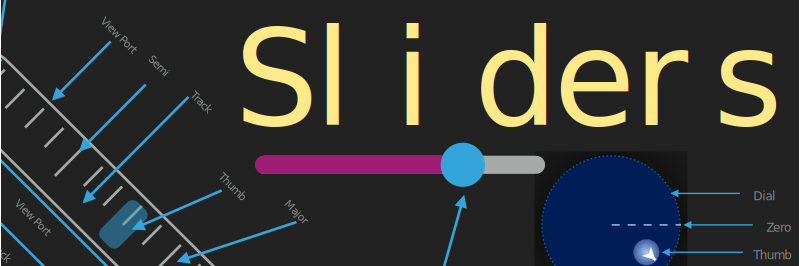

    

    
    

**Sliders** is a compilation of all my stylable drag based SwiftUI components. It provides a variety of unique controls as well as an enhanced version of the normal `Slider` called an `LSlider`. You can try them all out quickly by clone the example [project](https://github.com/kieranb662/SlidersExamples)

The various components are: 
* `LSlider` - a spatially adaptive slider that fits to its container at any angle you decide.
* `RSlider` - A circularly shaped slider which restricts movement of the thumb to the radius of the circle 
* `PSlider` - Turn any `Shape` into its very own slider!
* `OverflowSlider` - A meter like slider which has two moving components, the track and the thumb. Also has velocity based gestures implemented 
* `TrackPad` - A 2D version of a normal slider, which restricts displacement of the thumb to the bounds of the track 
* `RadialPad` - A joystick like component that does not reset the position of the thumb upon gesture end. 
* `Joystick` - an onscreen joystick that can appear anywhere the user drags within the defined hitbox, if the drag ends inside the lockbox, the joystick remains onscreen locked in the forward position. if the drag ends **not** inside the lockbox the joystick fades away until the hitbox is dragged again.

## Examples Created Using Sliders 

    
    
    
    

## Dependencies 

* [CGExtender](https://github.com/kieranb662/CGExtender)
* [Shapes](https://github.com/kieranb662/Shapes) - Currently looking for contributors 
* [bez](https://github.com/kieranb662/bez)

