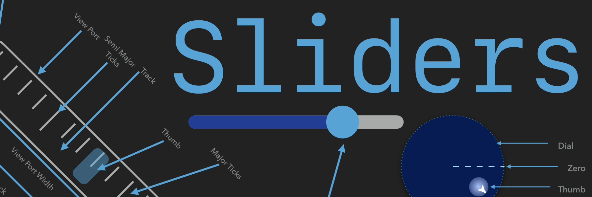

<p align="center">
    
</p>

<p align="center">
    
    
    
    
</p>

**Sliders** is a compilation of all my stylable drag based SwiftUI components. It provides a variety of unique controls as well as an enhanced version of the normal `Slider` called an `LSlider`. You can try them all out quickly by cloning the example [project](https://github.com/kieranb662/SlidersExamples)

<p align="center">
    
</p>


The various components are: 
* `LSlider` - a spatially adaptive slider that fits to its container at any angle you decide.
* `RSlider` - A circularly shaped slider which restricts movement of the thumb to the radius of the circle 
* `PSlider` - Turn any `Shape` into its very own slider!
* `OverflowSlider` - A meter like slider which has two moving components, the track and the thumb. Also has velocity based gestures implemented 
* `TrackPad` - A 2D version of a normal slider, which restricts displacement of the thumb to the bounds of the track 
* `RadialPad` - A joystick like component that does not reset the position of the thumb upon gesture end. 
* `Joystick` - an onscreen joystick that can appear anywhere the user drags within the defined hitbox, if the drag ends inside the lockbox, the joystick remains onscreen locked in the forward position. if the drag ends **not** inside the lockbox the joystick fades away until the hitbox is dragged again.


## Requirements 

**Sliders** as a default requires the SwiftUI Framework to be operational and since the `DragGesture` is required only these platforms can make use of the library:

* macOS 26 or Greater 
* iOS 26 or Greater 
* watchOS 26 or Greater

## How To Add To Your Project

1. Snag that URL from the github repo 
2. In Xcode -> File -> Swift Packages -> Add Package Dependencies 
3. Paste the URL Into the box
4. Specify the minimum version number.

## LSlider

### Spatially Adaptive Linear Slider

`LSlider` is a fully stylable linear slider that fits itself to its container at any angle. Unlike the built-in `Slider`, you can place an `LSlider` horizontally, vertically, or at any diagonal and it will automatically scale its track to the available space. Tick marks can be added and will optionally fire haptic feedback as the thumb passes over them.

### Parameters

| Parameter | Type | Default | Description |
|---|---|---|---|
| `value` | `Binding<Double>` | required | The value the slider controls |
| `range` | `ClosedRange<Double>` | `0...1` | The minimum and maximum values |
| `angle` | `Angle` | `.zero` (horizontal) | The angle at which the slider is drawn |
| `keepThumbInTrack` | `Bool` | `false` | Constrains the thumb centre to stay within the track's extent |
| `trackThickness` | `Double` | `20` | The thickness of the track in points |
| `tickMarkSpacing` | `TickMarkSpacing?` | `nil` | How tick marks are spaced, or `nil` to hide them |
| `hapticFeedbackEnabled` | `Bool` | `true` | Whether crossing a tick mark triggers haptic feedback (iOS only) |

### Basic Usage

A horizontal slider over a `0...1` range with no tick marks:

```swift
@State var volume = 0.5

LSlider($volume, range: 0...1, keepThumbInTrack: true, trackThickness: 20)
    .frame(height: 60)
```

A vertical slider (90 degrees):

```swift
@State var brightness = 0.75

LSlider($brightness, range: 0...1, angle: .degrees(90), keepThumbInTrack: true)
    .frame(width: 60, height: 200)
```

A diagonal slider:

```swift
@State var value = 0.5

LSlider($value, range: 0...1, angle: .degrees(325), keepThumbInTrack: true, trackThickness: 20)
    .frame(width: 300, height: 120)
```

### Tick Marks

Tick marks are controlled through the `TickMarkSpacing` enum. There are three cases:

**`.count(n)`** places exactly `n` tick marks evenly distributed across the range, including both endpoints:

```swift
@State var step = 0.5

// Places 11 ticks at 0.0, 0.1, 0.2, ... 1.0
LSlider(
    $step,
    range: 0...1,
    keepThumbInTrack: true,
    trackThickness: 20,
    tickMarkSpacing: .count(11),
    hapticFeedbackEnabled: true
)
.frame(height: 60)
```

**`.spacing(step)`** places a tick mark every `step` units across the value domain:

```swift
@State var temperature = 3.0

// Places ticks at 0, 1, 2, 3 ... 10
LSlider(
    $temperature,
    range: 0...10,
    keepThumbInTrack: true,
    trackThickness: 20,
    tickMarkSpacing: .spacing(1),
    hapticFeedbackEnabled: true
)
.frame(height: 60)
```

**`.values([...])`** places tick marks at specific values within the range:

```swift
@State var position = 0.5

LSlider(
    $position,
    range: 0...1,
    keepThumbInTrack: true,
    trackThickness: 20,
    tickMarkSpacing: .values([0.0, 0.25, 0.5, 0.75, 1.0]),
    hapticFeedbackEnabled: false
)
.frame(height: 60)
```

### Haptic Feedback

Haptic feedback fires each time the thumb passes over a tick mark. It is powered by `CoreHaptics` and is available on iOS. On platforms that do not support `CoreHaptics` the calls are silently ignored. To disable haptics entirely, pass `hapticFeedbackEnabled: false`. Haptics require tick marks to be configured; if `tickMarkSpacing` is `nil` no feedback is fired.

### Styling the Slider

Conform to `LSliderStyle` and implement three methods:

- `makeThumb(configuration:)` -- the draggable thumb view
- `makeTrack(configuration:)` -- the track and fill view
- `makeTickMark(configuration:tickValue:)` -- the view rendered at each tick mark position

Apply your style using the `linearSliderStyle(_:)` modifier on the slider or any ancestor view.

All three methods receive an `LSliderConfiguration` that exposes the current state of the slider:

```swift
struct LSliderConfiguration {
    let isDisabled: Bool       // Whether the slider is disabled
    let isActive: Bool         // Whether the thumb is currently being dragged
    let pctFill: Double        // Fill percentage from 0.0 to 1.0
    let value: Double          // The current value
    let angle: Angle           // The angle of the slider
    let min: Double            // The lower bound of the range
    let max: Double            // The upper bound of the range
    let keepThumbInTrack: Bool // Whether the thumb is constrained to the track
    let trackThickness: Double // The track thickness in points
    let tickMarkSpacing: TickMarkSpacing? // The tick spacing configuration, or nil
    let tickValues: [Double]   // The resolved tick mark values
}
```

### Custom Style Example

The following style draws an orange bar track and diamond-shaped tick marks that grow and brighten as the thumb approaches them:

```swift
struct BarLSliderStyle: LSliderStyle {
    func makeThumb(configuration: LSliderConfiguration) -> some View {
        RoundedRectangle(cornerRadius: 4)
            .fill(configuration.isActive ? Color.orange : Color.white)
            .frame(width: configuration.trackThickness, height: configuration.trackThickness * 1.4)
            .shadow(radius: 3)
    }

    func makeTrack(configuration: LSliderConfiguration) -> some View {
        let adjustment: Double = configuration.keepThumbInTrack
            ? configuration.trackThickness * (1 - configuration.pctFill)
            : configuration.trackThickness / 2

        return ZStack {
            AdaptiveLine(thickness: configuration.trackThickness, angle: configuration.angle)
                .fill(Color(white: 0.2))
            AdaptiveLine(
                thickness: configuration.trackThickness,
                angle: configuration.angle,
                percentFilled: configuration.pctFill,
                cap: .square,
                adjustmentForThumb: adjustment / 2
            )
            .fill(Color.orange)
            .mask(AdaptiveLine(thickness: configuration.trackThickness, angle: configuration.angle))
        }
    }

    func makeTickMark(configuration: LSliderConfiguration, tickValue: Double) -> some View {
        let range = configuration.max - configuration.min
        let thumbPct = range > 0 ? (configuration.value - configuration.min) / range : 0
        let tickPct  = range > 0 ? (tickValue          - configuration.min) / range : 0
        let distance  = abs(thumbPct - tickPct)
        let proximity = max(0, 1 - distance / 0.15)

        let size    = 6.0 + 6.0 * proximity
        let opacity = 0.4 + 0.6 * proximity

        return Rectangle()
            .fill(Color.orange.opacity(opacity))
            .frame(width: size, height: size)
            .rotationEffect(.degrees(45))
            .animation(.easeOut(duration: 0.08), value: proximity)
    }
}
```

Apply the style to a slider:

```swift
@State var value = 0.5

LSlider(
    $value,
    range: 0...1,
    keepThumbInTrack: true,
    trackThickness: 40,
    tickMarkSpacing: .spacing(0.1),
    hapticFeedbackEnabled: true
)
.linearSliderStyle(BarLSliderStyle())
.frame(height: 60)
```

The `linearSliderStyle` modifier cascades through the view hierarchy, so you can apply one style to a container and have it affect every `LSlider` inside it:

```swift
VStack {
    LSlider($red,   range: 0...1)
    LSlider($green, range: 0...1)
    LSlider($blue,  range: 0...1)
}
.linearSliderStyle(BarLSliderStyle())
```

## Double Linear Slider

`DoubleLSlider` is a linear **range** slider with two independent thumbs — a lower (start) thumb and an upper (end) thumb — connected by a draggable active-track segment. All three elements respond to drag gestures, making it easy to select and pan a range of values on a linear track at any angle.

### What it does

- Lets the user define a range by dragging a **lower thumb** and an **upper thumb** independently along the track.
- The **active-track segment** between the two thumbs can be dragged to shift the entire range while keeping its width constant.
- Enforces a **`minimumDistance`** between the two thumbs so they can never overlap.
- Supports any track angle, tick marks, magnetic affinity (snap to tick), and haptic feedback.

### Parameters

| Parameter | Type | Default | Description |
|---|---|---|---|
| `lowerValue` | `Binding<Double>` | required | The start (lower) value of the selected range |
| `upperValue` | `Binding<Double>` | required | The end (upper) value of the selected range |
| `range` | `ClosedRange<Double>` | `0...1` | The allowed value domain |
| `angle` | `Angle` | `.zero` (horizontal) | The angle at which the track is drawn |
| `keepThumbInTrack` | `Bool` | `false` | Constrains thumb centres to stay within the track's extent |
| `trackThickness` | `Double` | `20` | The thickness of the track in points |
| `minimumDistance` | `Double?` | 5 % of span | Smallest gap in value units between the two thumbs |
| `tickMarkSpacing` | `TickMarkSpacing?` | `nil` | Tick mark placement. Use `nil` to hide tick marks |
| `hapticFeedbackEnabled` | `Bool` | `true` | Whether crossing a tick mark triggers haptic feedback (iOS only) |
| `affinityEnabled` | `Bool` | `false` | Enables magnetic snap toward tick marks |
| `affinityRadius` | `Double` | `0.04` | Snap pull radius as a fraction of the full value range |
| `affinityResistance` | `Double` | `0.02` | Extra escape distance beyond `affinityRadius` |

### Basic Usage

A horizontal range slider over a `0...1` domain:

```swift
@State private var lower = 0.25
@State private var upper = 0.75

DoubleLSlider(
    lowerValue: $lower,
    upperValue: $upper,
    range: 0...1,
    keepThumbInTrack: true,
    trackThickness: 20
)
.frame(height: 60)
```

### Vertical Slider

Pass `angle: .degrees(90)` and give the view a tall frame:

```swift
@State private var lower = 20.0
@State private var upper = 80.0

DoubleLSlider(
    lowerValue: $lower,
    upperValue: $upper,
    range: 0...100,
    angle: .degrees(90),
    keepThumbInTrack: true
)
.frame(width: 60, height: 200)
```

### Angled Slider

The track adapts to any angle, fitting itself to the available container space:

```swift
@State private var lower = 0.2
@State private var upper = 0.8

DoubleLSlider(
    lowerValue: $lower,
    upperValue: $upper,
    range: 0...1,
    angle: .degrees(30),
    keepThumbInTrack: true,
    trackThickness: 20
)
.frame(width: 300, height: 120)
```

### Minimum Distance

`minimumDistance` ensures the two thumbs never collapse on top of each other. Specify it in value-domain units. If omitted it defaults to 5 % of the range span.

```swift
@State private var lower = 0.1
@State private var upper = 0.9

// Thumbs must stay at least 0.15 apart
DoubleLSlider(
    lowerValue: $lower,
    upperValue: $upper,
    range: 0...1,
    keepThumbInTrack: true,
    minimumDistance: 0.15
)
.frame(height: 60)
```

### Tick Marks

Tick marks use the same `TickMarkSpacing` enum as `LSlider`.

**`.count(n)`** — evenly distribute `n` tick marks across the range:

```swift
@State private var lower = 0.0
@State private var upper = 0.5

DoubleLSlider(
    lowerValue: $lower,
    upperValue: $upper,
    range: 0...1,
    keepThumbInTrack: true,
    trackThickness: 20,
    tickMarkSpacing: .count(11)   // ticks at 0.0, 0.1, 0.2 … 1.0
)
.frame(height: 60)
```

**`.spacing(step)`** — place a tick mark every `step` units:

```swift
@State private var lower = 0.0
@State private var upper = 6.0

DoubleLSlider(
    lowerValue: $lower,
    upperValue: $upper,
    range: 0...12,
    keepThumbInTrack: true,
    trackThickness: 20,
    tickMarkSpacing: .spacing(1)   // ticks at 0, 1, 2 … 12
)
.frame(height: 60)
```

**`.values([...])`** — place tick marks at specific values:

```swift
@State private var lower = 0.25
@State private var upper = 0.75

DoubleLSlider(
    lowerValue: $lower,
    upperValue: $upper,
    range: 0...1,
    keepThumbInTrack: true,
    trackThickness: 20,
    tickMarkSpacing: .values([0.0, 0.25, 0.5, 0.75, 1.0])
)
.frame(height: 60)
```

### Tick Affinity (Snapping)

When `affinityEnabled` is `true` and `tickMarkSpacing` is set, each thumb is pulled magnetically onto the nearest tick mark when it comes within `affinityRadius` of one. The thumb stays locked to the tick until dragged beyond `affinityRadius + affinityResistance`.

```swift
@State private var lower = 0.0
@State private var upper = 0.5

DoubleLSlider(
    lowerValue: $lower,
    upperValue: $upper,
    range: 0...1,
    keepThumbInTrack: true,
    trackThickness: 20,
    tickMarkSpacing: .count(11),
    affinityEnabled: true,
    affinityRadius: 0.03,
    affinityResistance: 0.015
)
.frame(height: 60)
```

### Dragging the Active Track

The filled segment between the two thumbs acts as a drag handle that shifts the entire range. The range width is held constant while both `lowerValue` and `upperValue` update together. This requires no special configuration — the gesture is always active on the filled segment.

### Haptic Feedback

Haptic feedback fires automatically (on supported platforms) when:

- A thumb reaches the minimum or maximum of the range (limit hit).
- A thumb crosses a tick mark (tick pulse, when `tickMarkSpacing` is set).
- A thumb snaps in or out of affinity with a tick mark (when `affinityEnabled` is `true`).

Each thumb has its own independent haptic engine so their events never interfere with each other. To disable all haptics, pass `hapticFeedbackEnabled: false`.

```swift
DoubleLSlider(
    lowerValue: $lower,
    upperValue: $upper,
    range: 0...1,
    keepThumbInTrack: true,
    trackThickness: 20,
    tickMarkSpacing: .count(11),
    hapticFeedbackEnabled: false
)
.frame(height: 60)
```

### Styling the Slider

Conform to `DoubleLSliderStyle` and implement four methods:

- `makeLowerThumb(configuration:)` — the draggable lower-bound thumb
- `makeUpperThumb(configuration:)` — the draggable upper-bound thumb
- `makeTrack(configuration:)` — the full track with the filled range segment
- `makeTickMark(configuration:tickValue:)` — the view rendered at each tick position (has a default implementation)

Apply a style using `.doubleLSliderStyle(_:)` on the slider or any ancestor view.

All four methods receive a `DoubleLSliderConfiguration` that exposes the current state:

```swift
struct DoubleLSliderConfiguration {
    let isDisabled: Bool          // Whether the slider is disabled
    let isLowerActive: Bool       // Whether the lower thumb is being dragged
    let isUpperActive: Bool       // Whether the upper thumb is being dragged
    let isRangeActive: Bool       // Whether the active-track segment is being dragged
    let lowerValue: Double        // The current lower value
    let upperValue: Double        // The current upper value
    let angle: Angle              // The angle of the track
    let min: Double               // Lower bound of the range
    let max: Double               // Upper bound of the range
    let keepThumbInTrack: Bool    // Whether thumbs are constrained to the track extent
    let trackThickness: Double    // Track thickness in points
    let tickMarkSpacing: TickMarkSpacing?  // Tick spacing config, or nil
    let tickValues: [Double]      // Resolved list of tick-mark values
    let affinityEnabled: Bool     // Whether affinity snapping is on
    let snappedLowerTickValue: Double?  // Tick the lower thumb is snapped to, or nil
    let snappedUpperTickValue: Double?  // Tick the upper thumb is snapped to, or nil

    var lowerPercent: Double  // lowerValue normalised to 0...1
    var upperPercent: Double  // upperValue normalised to 0...1
}
```

### Custom Style Example

The following style draws an indigo range segment, diamond-shaped tick marks that grow as either thumb approaches, and pill-shaped thumbs that highlight when active:

```swift
struct IndigoRangeStyle: DoubleLSliderStyle {

    func makeLowerThumb(configuration: DoubleLSliderConfiguration) -> some View {
        let active = configuration.isLowerActive || configuration.isRangeActive
        return Capsule()
            .fill(active ? Color.white : Color.indigo)
            .frame(width: configuration.trackThickness, height: configuration.trackThickness * 1.6)
            .rotationEffect(configuration.angle)
            .shadow(color: .black.opacity(0.25), radius: active ? 6 : 2)
    }

    func makeUpperThumb(configuration: DoubleLSliderConfiguration) -> some View {
        let active = configuration.isUpperActive || configuration.isRangeActive
        return Capsule()
            .fill(active ? Color.white : Color.indigo)
            .frame(width: configuration.trackThickness, height: configuration.trackThickness * 1.6)
            .rotationEffect(configuration.angle)
            .shadow(color: .black.opacity(0.25), radius: active ? 6 : 2)
    }

    func makeTrack(configuration: DoubleLSliderConfiguration) -> some View {
        let lo = configuration.lowerPercent
        let hi = configuration.upperPercent
        let T  = configuration.trackThickness

        return ZStack {
            // Full unfilled track
            AdaptiveLine(thickness: T, angle: configuration.angle)
                .fill(Color(white: 0.2))

            // Filled segment from lowerPercent to upperPercent
            AdaptiveLine(thickness: T, angle: configuration.angle, percentFilled: hi,
                         adjustmentForThumb: T / 2)
                .fill(Color.indigo)
                .mask(
                    AdaptiveLine(thickness: T, angle: configuration.angle,
                                 percentFilled: 1 - lo, adjustmentForThumb: T / 2)
                        .fill(Color.white)
                        .rotationEffect(.degrees(180))
                )
                .mask(AdaptiveLine(thickness: T, angle: configuration.angle))
        }
    }

    func makeTickMark(configuration: DoubleLSliderConfiguration, tickValue: Double) -> some View {
        let range = configuration.max - configuration.min
        guard range > 0 else { return AnyView(EmptyView()) }
        let loPct = (configuration.lowerValue - configuration.min) / range
        let hiPct = (configuration.upperValue - configuration.min) / range
        let tickPct = (tickValue - configuration.min) / range
        let proximity = max(
            max(0, 1 - abs(loPct - tickPct) / 0.15),
            max(0, 1 - abs(hiPct - tickPct) / 0.15)
        )
        let size = 5.0 + 6.0 * proximity
        return AnyView(
            Rectangle()
                .fill(Color.indigo.opacity(0.4 + 0.6 * proximity))
                .frame(width: size, height: size)
                .rotationEffect(.degrees(45))
                .animation(.easeOut(duration: 0.08), value: proximity)
        )
    }
}
```

Apply it to a slider:

```swift
@State private var lower = 0.2
@State private var upper = 0.8

DoubleLSlider(
    lowerValue: $lower,
    upperValue: $upper,
    range: 0...1,
    keepThumbInTrack: true,
    trackThickness: 24,
    tickMarkSpacing: .count(9)
)
.doubleLSliderStyle(IndigoRangeStyle())
.frame(height: 60)
```

The modifier cascades through the view hierarchy, so you can style multiple sliders at once:

```swift
VStack {
    DoubleLSlider(lowerValue: $lowerA, upperValue: $upperA)
    DoubleLSlider(lowerValue: $lowerB, upperValue: $upperB)
}
.doubleLSliderStyle(IndigoRangeStyle())
```

You can also use the built-in default style with custom colours:

```swift
DoubleLSlider(lowerValue: $lower, upperValue: $upper)
    .doubleLSliderStyle(
        .default(
            trackColor: Color(white: 0.2),
            trackFilledColor: .indigo,
            lowerThumbColor: .indigo,
            upperThumbColor: .indigo,
            activeThumbColor: .white,
            trackThickness: 20
        )
    )
    .frame(height: 60)
```

## Radial Slider

`RSlider` is a circular slider for SwiftUI. The thumb moves around a circular track and updates a bound `Double` value.

### What it does

- Maps a value in `range` onto a circle.
- Supports partial or multiple rotations using `maxWinds`.
- Can show tick marks around the track using `TickMarkSpacing`.
- Can optionally snap to tick marks using magnetic affinity.
- Can emit haptic feedback (where available). You can disable it with `disableHaptics`.

### Parameters

| Parameter | Type | Default | Description |
|---|---|---|---|
| `value` | `Binding<Double>` | required | The value the slider controls |
| `range` | `ClosedRange<Double>` | `0...1` | The minimum and maximum values |
| `originAngle` | `Angle` | `.zero` | The angle that corresponds to the minimum value (3 o'clock by default) |
| `maxWinds` | `Double` | `1` | Number of full rotations spanned by the range. Fractional winds are supported |
| `tickSpacing` | `TickMarkSpacing?` | `nil` | Tick mark placement. Use `nil` to hide tick marks |
| `affinityEnabled` | `Bool` | `false` | Enables snapping toward tick marks |
| `affinityRadius` | `Double` | `0.04` | Snap radius as a fraction of the full value range |
| `affinityResistance` | `Double` | `0.02` | Extra escape distance beyond `affinityRadius`, also as a fraction of the full value range |
| `disableHaptics` | `Bool` | `false` | Disables all haptic feedback |

### Basic usage

```swift
@State private var value = 0.5

RSlider($value)
    .frame(width: 180, height: 180)
```

### Set a range and start angle

`originAngle` sets where the minimum value is located on the circle.

```swift
@State private var temperature = 20.0

RSlider($temperature, range: 0...100, originAngle: .degrees(-90))
    .frame(width: 220, height: 220)
```

### Multiple rotations using winds

`maxWinds` controls how many full rotations are used to cover the entire value range.

```swift
@State private var revolutionsValue = 0.0

RSlider($revolutionsValue, range: 0...1, maxWinds: 3)
    .frame(width: 220, height: 220)
```

### Tick marks

Tick marks are controlled through `TickMarkSpacing`.

```swift
@State private var stepped = 0.5

RSlider($stepped, range: 0...1, tickSpacing: .count(11))
    .frame(width: 220, height: 220)
```

### Tick affinity (snapping)

When `affinityEnabled` is `true`, the thumb is pulled onto the nearest tick when it is close enough.

```swift
@State private var snapped = 0.5

RSlider(
    $snapped,
    range: 0...1,
    tickSpacing: .count(11),
    affinityEnabled: true,
    affinityRadius: 0.02,
    affinityResistance: 0.01
)
.frame(width: 220, height: 220)
```

### Styling the slider

To create a custom style, conform to `RSliderStyle` and implement:
- `makeThumb(configuration:)`
- `makeTrack(configuration:)`
- `makeTickMark(configuration:tickValue:)`

Apply a style using `radialSliderStyle(_:)` on the slider or a parent view.

`RSliderConfiguration` provides the style with the current state, including the current `value`,
`angle`, tick mark values, and wind information.

```swift
struct ExampleRSliderStyle: RSliderStyle {
    func makeThumb(configuration: RSliderConfiguration) -> some View {
        Circle()
            .fill(configuration.isActive ? Color.cyan : Color.white)
            .frame(width: 28, height: 28)
            .shadow(radius: 2)
    }

    func makeTrack(configuration: RSliderConfiguration) -> some View {
        ZStack {
            Circle()
                .stroke(Color.gray.opacity(0.3), lineWidth: 18)

            CircularArc(percent: configuration.withinWind)
                .stroke(Color.cyan, style: StrokeStyle(lineWidth: 18, lineCap: .round))
        }
        .padding(9)
    }

    func makeTickMark(configuration: RSliderConfiguration, tickValue: Double) -> some View {
        let range = configuration.max - configuration.min
        let thumbPct = range > 0 ? (configuration.value - configuration.min) / range : 0
        let tickPct  = range > 0 ? (tickValue          - configuration.min) / range : 0
        let proximity = max(0, 1 - abs(thumbPct - tickPct) / 0.20)

        let size    = 4.0 + 6.0 * proximity
        let opacity = 0.35 + 0.65 * proximity

        return Circle()
            .fill(Color.white.opacity(opacity))
            .frame(width: size, height: size)
            .animation(.easeOut(duration: 0.1), value: proximity)
    }
}

@State private var styledValue = 0.4

RSlider($styledValue, range: 0...1, tickSpacing: .count(11))
    .radialSliderStyle(ExampleRSliderStyle())
    .frame(width: 220, height: 220)
```

You can also use the built-in styles:

```swift
RSlider($value)
    .radialSliderStyle(.default(trackThickness: 18))

RSlider($value)
    .radialSliderStyle(.knob)
```

## Double Radial Slider

`DoubleRSlider` is a circular **range** slider with two independent thumbs — a lower (start) thumb and an upper (end) thumb — connected by a draggable active-track arc. All three elements respond to drag gestures, making it easy to select and pan a range of values on a circular track.

### What it does

- Lets the user define a range by dragging a **lower thumb** and an **upper thumb** independently around a full circle.
- The **active-track arc** between the two thumbs can be dragged to shift the entire range while keeping its width constant.
- Enforces a **`minimumDistance`** between the two thumbs so they can never overlap.
- Supports tick marks, magnetic affinity (snap to tick), and haptic feedback — all independently configurable per thumb.

### Parameters

| Parameter | Type | Default | Description |
|---|---|---|---|
| `lowerValue` | `Binding<Double>` | required | The start (lower) value of the selected range |
| `upperValue` | `Binding<Double>` | required | The end (upper) value of the selected range |
| `range` | `ClosedRange<Double>` | `0...1` | The allowed value domain |
| `originAngle` | `Angle` | `.zero` | The angle that corresponds to the minimum value (3 o'clock by default) |
| `minimumDistance` | `Double?` | 5 % of span | Smallest gap in value units between the two thumbs |
| `tickSpacing` | `TickMarkSpacing?` | `nil` | Tick mark placement. Use `nil` to hide tick marks |
| `affinityEnabled` | `Bool` | `false` | Enables magnetic snap toward tick marks |
| `affinityRadius` | `Double` | `0.04` | Snap pull radius as a fraction of the full value range |
| `affinityResistance` | `Double` | `0.02` | Extra escape distance beyond `affinityRadius` |
| `disableHaptics` | `Bool` | `false` | Suppresses all haptic feedback |

### Basic Usage

```swift
@State private var lower = 0.25
@State private var upper = 0.75

DoubleRSlider(lowerValue: $lower, upperValue: $upper)
    .frame(width: 220, height: 220)
```

### Set a range and origin angle

`originAngle` sets where the minimum value is located on the circle.

```swift
@State private var temperature = 20.0

DoubleRSlider(lowerValue: $temperature, upperValue: $upperTemperature, range: 0...100, originAngle: .degrees(-90))
    .frame(width: 240, height: 240)
```

### Minimum Distance

`minimumDistance` ensures the two thumbs never collapse on top of each other. Specify it in value-domain units. If omitted it defaults to 5 % of the range span.

```swift
@State private var lower = 0.1
@State private var upper = 0.9

// Thumbs must stay at least 0.1 apart
DoubleRSlider(
    lowerValue: $lower,
    upperValue: $upper,
    range: 0...1,
    minimumDistance: 0.1
)
.frame(width: 220, height: 220)
```

### Tick Marks

Tick marks use the same `TickMarkSpacing` enum as the other sliders.

**`.count(n)`** — evenly distribute `n` tick marks across the range:

```swift
@State private var lower = 0.0
@State private var upper = 0.5

DoubleRSlider(
    lowerValue: $lower,
    upperValue: $upper,
    range: 0...1,
    tickSpacing: .count(9)   // ticks at 0, 0.125, 0.25 … 1.0
)
.frame(width: 220, height: 220)
```

**`.spacing(step)`** — place a tick mark every `step` units:

```swift
@State private var lower = 0.0
@State private var upper = 6.0

DoubleRSlider(
    lowerValue: $lower,
    upperValue: $upper,
    range: 0...12,
    tickSpacing: .spacing(1)   // ticks at 0, 1, 2 … 12
)
.frame(width: 220, height: 220)
```

**`.values([...])`** — place tick marks at specific values:

```swift
@State private var lower = 0.25
@State private var upper = 0.75

DoubleRSlider(
    lowerValue: $lower,
    upperValue: $upper,
    range: 0...1,
    tickSpacing: .values([0.0, 0.25, 0.5, 0.75, 1.0])
)
.frame(width: 220, height: 220)
```

### Tick Affinity (Snapping)

When `affinityEnabled` is `true` and `tickSpacing` is set, each thumb is pulled magnetically onto the nearest tick mark when it comes within `affinityRadius` of one. The thumb stays locked to the tick until it is dragged beyond `affinityRadius + affinityResistance`.

```swift
@State private var lower = 0.0
@State private var upper = 0.5

DoubleRSlider(
    lowerValue: $lower,
    upperValue: $upper,
    range: 0...1,
    tickSpacing: .count(9),
    affinityEnabled: true,
    affinityRadius: 0.03,
    affinityResistance: 0.015
)
.frame(width: 220, height: 220)
```

### Dragging the Active Track

The filled arc between the two thumbs acts as a drag handle that shifts the entire range. The range width is held constant while both `lowerValue` and `upperValue` update together. This requires no special configuration — the gesture is always active on the arc.

### Haptic Feedback

Haptic feedback fires automatically (on supported platforms) when:

- A thumb reaches the minimum or maximum of the range (limit hit).
- A thumb crosses a tick mark (tick pulse, when `tickSpacing` is set).
- A thumb snaps in or out of affinity with a tick mark (when `affinityEnabled` is `true`).

Each thumb has its own independent haptic engine so their events never interfere with each other. Disable all haptics with `disableHaptics: true`.

```swift
DoubleRSlider(
    lowerValue: $lower,
    upperValue: $upper,
    range: 0...1,
    tickSpacing: .count(11),
    disableHaptics: true
)
.frame(width: 220, height: 220)
```

### Styling the Slider

To create a custom style, conform to `DoubleRSliderStyle` and implement:
- `makeLowerThumb(configuration:)`
- `makeUpperThumb(configuration:)`
- `makeTrack(configuration:)`
- `makeTickMark(configuration:tickValue:)` — the view rendered at each tick position (has a default implementation)

Apply a style using `.doubleRadialSliderStyle(_:)` on the slider or any ancestor view.

`DoubleRSliderConfiguration` provides the style with the current state, including the current `lowerValue`,
`upperValue`, `angle`, tick mark values, and wind information.

```swift
struct DoubleRSliderConfiguration {
    let isDisabled: Bool          // Whether the slider is disabled
    let isLowerActive: Bool       // Whether the lower thumb is being dragged
    let isUpperActive: Bool       // Whether the upper thumb is being dragged
    let isRangeActive: Bool       // Whether the active-track arc is being dragged
    let lowerValue: Double        // The current lower value
    let upperValue: Double        // The current upper value
    let lowerAngle: Angle         // Angle on the circle for lowerValue
    let upperAngle: Angle         // Angle on the circle for upperValue
    let originAngle: Angle        // Angle that maps to the minimum value
    let min: Double               // Lower bound of the range
    let max: Double               // Upper bound of the range
    let tickMarkSpacing: TickMarkSpacing?  // Tick spacing config, or nil
    let tickValues: [Double]      // Resolved list of tick-mark values
    let affinityEnabled: Bool     // Whether affinity snapping is on
    let snappedLowerTickValue: Double?  // Tick the lower thumb is snapped to, or nil
    let snappedUpperTickValue: Double?  // Tick the upper thumb is snapped to, or nil

    var lowerPercent: Double  // lowerValue normalised to 0...1
    var upperPercent: Double  // upperValue normalised to 0...1
}
```

### Custom Style Example

The following style draws a dark circular track with a teal filled arc and square thumbs that highlight when active:

```swift
struct TealRangeStyle: DoubleRSliderStyle {

    func makeLowerThumb(configuration: DoubleRSliderConfiguration) -> some View {
        let active = configuration.isLowerActive || configuration.isRangeActive
        return RoundedRectangle(cornerRadius: 6)
            .fill(active ? Color.teal : Color.white)
            .frame(width: 28, height: 28)
            .shadow(color: .black.opacity(0.25), radius: active ? 6 : 2)
    }

    func makeUpperThumb(configuration: DoubleRSliderConfiguration) -> some View {
        let active = configuration.isUpperActive || configuration.isRangeActive
        return RoundedRectangle(cornerRadius: 6)
            .fill(active ? Color.teal : Color.white)
            .frame(width: 28, height: 28)
            .shadow(color: .black.opacity(0.25), radius: active ? 6 : 2)
    }

    func makeTrack(configuration: DoubleRSliderConfiguration) -> some View {
        let arcLength = configuration.upperPercent - configuration.lowerPercent
        return ZStack {
            Circle()
                .stroke(Color.gray.opacity(0.3), lineWidth: 18)

            CircularArc(percent: arcLength)
                .stroke(Color.teal, style: StrokeStyle(lineWidth: 18, lineCap: .round))
        }
        .padding(9)
    }

    func makeTickMark(configuration: DoubleRSliderConfiguration, tickValue: Double) -> some View {
        Circle()
            .fill(Color.white.opacity(0.5))
            .frame(width: 5, height: 5)
    }
}

@State private var lower = 0.2
@State private var upper = 0.8

DoubleRSlider(
    lowerValue: $lower,
    upperValue: $upper,
    range: 0...1,
    tickSpacing: .count(9)
)
.doubleRadialSliderStyle(TealRangeStyle())
.frame(width: 240, height: 240)
```

You can also use the built-in default style with custom colours:

```swift
DoubleRSlider(lowerValue: $lower, upperValue: $upper)
    .doubleRadialSliderStyle(
        .default(
            trackColor: Color(white: 0.25),
            trackFilledColor: .indigo,
            lowerThumbColor: .white,
            upperThumbColor: .white,
            activeThumbColor: .cyan,
            trackThickness: 20
        )
    )
    .frame(width: 220, height: 220)
```

## Path Slider
 A View that turns any `Shape` into a slider. Its great for creating unique user experiences 

 - **parameters**:
     - `value`: a `Binding<Double>` value which represents the percent fill of the slider between  (0,1).
     - `shape`: The `Shape` to be used as the sliders track
     - `range`: `ClosedRange<Double>` The minimum and maximum numbers that `value` can be
     - `isDisabled`: `Bool` Whether or not the slider should be disabled

### Styling The Slider

 To create a custom style for the slider you need to create a `PSliderStyle` conforming struct. Conformance requires implementation of 2 methods
 
1. `makeThumb`: which creates the draggable portion of the slider
2. `makeTrack`: which creates the track which fills or empties as the thumb is dragging within it

 Both methods provide access to state values through the `PSliderConfiguration` struct
````Swift
struct PSliderConfiguration {
    let isDisabled: Bool // whether or not  the slider is disabled
    let isActive: Bool // whether or not the thumb is currently dragging
    let pctFill: Double  // The percentage of the sliders track that is filled
    let value: Double // The current value of the slider
    let angle: Angle // Angle of the thumb
    let min: Double  // The minimum value of the sliders range
    let max: Double // The maximum value of the sliders range
}
````
 To make this easier just copy and paste the following style based on the `DefaultPSliderStyle`. After creating your custom style
  apply it by calling the `pathSliderStyle` method on the `PSlider` or a view containing it.

```Swift
struct <#My PSlider Style#>: PSliderStyle {
     func makeThumb(configuration:  PSliderConfiguration) -> some View {
         Circle()
             .frame(width: 30, height:30)
             .foregroundColor(configuration.isActive ? Color.yellow : Color.white)
     }

    func makeTrack(configuration:  PSliderConfiguration) -> some View {
        configuration.shape
             .stroke(Color.gray, lineWidth: 8)
             .overlay(
                 configuration.shape
                     .trim(from: 0, to: CGFloat(configuration.pctFill))
                     .stroke(Color.purple, lineWidth: 10)
             )
    }
}
```

## Overflow Slider

A Slider which has a fixed frame but a movable track in the background. Used for values that have a discrete nature to them but would not necessarily fit on screen.
Both the thumb and track can be dragged, if the track is dragged and thrown the velocity of the throw is added to the tracks velocity and it slows gradually to a stop.
If the thumb is currently being dragged and reaches the minimum or maximum value of its bounds, velocity is added to the track in the opposite direction of the drag. 

- **parameters**:
    - `value`: `Binding<Double>` The value the slider should control
    - `range`: `ClosedRange<Double>` The minimum and maximum numbers that `value` can be
    - `isDisabled`: `Bool` Whether or not the slider should be disabled

## Styling The Slider
 
  To create a custom style for the slider you need to create a `OverflowSliderStyle` conforming struct. Conformance requires implementation of 2 methods
  
 1. `makeThumb`: which creates the draggable portion of the slider
 2. `makeTrack`: which creates the draggable background track
 
  Both methods provide access to the sliders current state thru the `OverflowSliderConfiguration` of the `OverflowSlider `to be styled.
  
```Swift
struct OverflowSliderConfiguration {
  let isDisabled: Bool // Whether the control is disabled or not
  let thumbIsActive: Bool // Whether the thumb is currently dragging or not
  let thumbIsAtLimit: Bool // Whether the thumb has reached its min/max displacement
  let trackIsActive: Bool // Whether of not the track is dragging
  let trackIsAtLimit: Bool // Whether the track has reached its min/max position
  let value: Double // The current value of the slider
  let min: Double // The minimum value of the sliders range
  let max: Double // The maximum value of the sliders range
  let tickSpacing: Double // The spacing of the sliders tick marks
}
```

  To make this easier just copy and paste the following style based on the `DefaultOverflowSliderStyle`. After creating your custom style apply it by calling the `overflowSliderStyle` method on the `OverflowSlider` or a view containing it.
  
```Swift
struct <#My OverflowSlider Style#>: OverflowSliderStyle {
    func makeThumb(configuration: OverflowSliderConfiguration) -> some View {
        RoundedRectangle(cornerRadius: 5)
            .fill(configuration.thumbIsActive ?  Color.orange : Color.blue)
            .opacity(0.5)
            .frame(width: 20, height: 50)
    }

    func makeTrack(configuration: OverflowSliderConfiguration) -> some View {
        let totalLength = configuration.max-configuration.min
        let spacing = configuration.tickSpacing

        return TickMarks(spacing: CGFloat(spacing), ticks: Int(totalLength/Double(spacing)))
            .stroke(Color.gray)
            .frame(width: CGFloat(totalLength))
    }
}
```

## Track Pad

`TrackPad` is the 2-D equivalent of a `Slider`. A draggable thumb moves freely inside a
rectangular area, controlling independent x and y values simultaneously. Lift your finger
to commit the position; drag the thumb slowly back near the ghost marker to snap back to
the last committed location. A full tick-mark grid lets you divide both axes into discrete
steps with magnetic snap-to-grid behaviour.

### What it does

- Controls a `CGPoint` value by dragging a thumb anywhere inside a rectangular track.
- Each axis has its own independent `ClosedRange`, so x and y can cover completely
  different domains.
- **Previous-value indicator** — a ghost marker is left at the last committed position
  (when the user lifts their finger). Drag slowly near it to snap back; fast swipes pass
  through freely.
- **Tick marks** — divide one or both axes into a regular grid. The thumb snaps magnetically
  to the nearest intersection when moving slowly.
- **Haptic feedback** — fires when the thumb hits a track edge (iOS), and softly when it
  snaps to a previous-value position or a tick-mark intersection.
- Fully stylable via the `TrackPadStyle` protocol.

### Parameters

| Parameter | Type | Default | Description |
|---|---|---|---|
| `value` | `Binding<CGPoint>` | required | The point whose x and y components the trackpad controls |
| `rangeX` | `ClosedRange<CGFloat>` | `0...1` | Valid domain for the x axis |
| `rangeY` | `ClosedRange<CGFloat>` | `0...1` | Valid domain for the y axis |
| `showPreviousValue` | `Bool` | `false` | Show a ghost marker at the last committed position and enable affinity snap |
| `previousValueAffinityRadius` | `Double` | `0.06` | Fraction of the track diagonal within which the previous-value snap activates |
| `previousValueAffinityResistance` | `Double` | `0.03` | Extra fraction beyond the pull radius the drag must travel to escape the snap |
| `previousValueVelocityThreshold` | `Double` | `180` | Max drag speed (pts/s) at which the snap can engage — fast swipes pass through |
| `tickCountX` | `Int` | `0` | Number of equal intervals along the x-axis (`0` = no tick marks) |
| `tickCountY` | `Int` | `0` | Number of equal intervals along the y-axis (`0` = no tick marks) |
| `tickAffinityRadius` | `Double` | `0.05` | Fraction of the track diagonal within which the thumb snaps to the nearest tick |
| `tickAffinityResistance` | `Double` | `0.02` | Extra fraction beyond the pull radius the drag must travel to escape a tick snap |
| `tickAffinityVelocityThreshold` | `Double` | `150` | Max drag speed (pts/s) at which tick snapping can engage |

### Basic Usage

A `TrackPad` over the default `0...1` range on both axes:

```swift
@State var point = CGPoint(x: 0.5, y: 0.5)

TrackPad($point)
    .frame(height: 260)
```

### Custom Ranges

Pass `rangeX` and `rangeY` independently when the axes cover different domains:

```swift
@State var point = CGPoint(x: 0.0, y: 5.0)

TrackPad($point, rangeX: -1...1, rangeY: 0...10)
    .frame(height: 260)
```

When both axes share the same domain, use the single `range` convenience initialiser:

```swift
@State var point = CGPoint(x: 50, y: 50)

TrackPad($point, range: 0...100)
    .frame(height: 260)
```

### Double Bindings

If your model stores x and y as separate `Double` properties you can bind to them directly
without a `CGPoint` wrapper:

```swift
@State var pan: Double = 0.0
@State var tilt: Double = 0.0

// Independent ranges
TrackPad(x: $pan, y: $tilt, rangeX: -1...1, rangeY: -1...1)
    .frame(height: 260)

// Shared range
TrackPad(x: $pan, y: $tilt, range: -1...1)
    .frame(height: 260)
```

### Previous Value Indicator

Enable `showPreviousValue` to leave a ghost marker at the position where the user last
lifted their finger. Dragging slowly back towards the marker will magnetically snap the
thumb to it.

```swift
@State var point = CGPoint(x: 0.5, y: 0.5)

TrackPad($point)
    .showPreviousValue(true)
    .frame(height: 260)
```

#### Tuning the Affinity

The snap behaviour is controlled by three modifiers. All distances are expressed as a
fraction of the track diagonal so they scale correctly with any frame size.

| Modifier | Description |
|---|---|
| `.previousValueAffinityRadius(_:)` | How close (fraction of diagonal) the thumb must be to activate the snap |
| `.previousValueAffinityResistance(_:)` | Extra fraction beyond the radius the drag must travel to break out |
| `.previousValueVelocityThreshold(_:)` | Maximum drag speed (pts/s) at which the snap can engage |

**Tight affinity** — snaps only when the thumb is within 3 % of the diagonal and moving
very slowly:

```swift
TrackPad($point)
    .showPreviousValue(true)
    .previousValueAffinityRadius(0.03)
    .previousValueAffinityResistance(0.01)
    .frame(height: 260)
```

**Loose affinity** — larger pull zone, tolerates faster movement:

```swift
TrackPad($point)
    .showPreviousValue(true)
    .previousValueAffinityRadius(0.12)
    .previousValueVelocityThreshold(350)
    .frame(height: 260)
```

### Tick Marks

Set `tickCountX` and/or `tickCountY` to positive integers to divide the track into a
regular grid. When both axes have ticks, the intersections also act as snap points.

#### Grid (both axes)

`.tickCount(_:)` is a convenience that sets the same interval count on both axes at once:

```swift
@State var point = CGPoint(x: 0.5, y: 0.5)

// 4×4 grid — 5 lines on each axis, 25 intersection snap points
TrackPad($point)
    .tickCount(4)
    .frame(height: 260)
```

#### Independent axis counts

```swift
// 3 columns, 5 rows
TrackPad($point)
    .tickCountX(3)
    .tickCountY(5)
    .frame(height: 260)
```

#### Single-axis tick lines

When only one axis has ticks, guide lines are drawn and single-axis snapping is applied:

```swift
// Vertical guide lines only — snaps to nearest x column
TrackPad($point)
    .tickCountX(4)
    .frame(height: 260)

// Horizontal guide lines only — snaps to nearest y row
TrackPad($point)
    .tickCountY(4)
    .frame(height: 260)
```

#### Tuning Tick Affinity

The tick snap behaviour mirrors the previous-value affinity and is independently tunable:

| Modifier | Description |
|---|---|
| `.tickAffinityRadius(_:)` | How close (fraction of diagonal) the thumb must be to snap to a tick |
| `.tickAffinityResistance(_:)` | Extra fraction beyond the radius the drag must travel to escape |
| `.tickAffinityVelocityThreshold(_:)` | Maximum drag speed (pts/s) at which the snap can engage |

**Generous pull zone** — easy to land on intersections, forgiving of imprecise drags:

```swift
TrackPad($point)
    .tickCount(3)
    .tickAffinityRadius(0.10)
    .tickAffinityResistance(0.04)
    .frame(height: 260)
```

**Precise grid** — only snaps when the thumb is very close and moving slowly:

```swift
TrackPad($point)
    .tickCount(8)
    .tickAffinityRadius(0.025)
    .tickAffinityResistance(0.010)
    .tickAffinityVelocityThreshold(80)
    .frame(height: 260)
```

### Haptic Feedback

Haptic feedback fires automatically on supported platforms (iOS) in three situations:

- **Edge hit** — medium impact when the thumb reaches the boundary of the track on either axis.
- **Previous-value snap** — soft impact at reduced intensity when the thumb locks onto the ghost position.
- **Tick snap** — soft impact at reduced intensity when the thumb locks onto a tick intersection.

There is no parameter to disable haptics on `TrackPad`; you can suppress them system-wide
using the `.allowsHitTesting(false)` modifier or by disabling the view.

### Styling

Conform to `TrackPadStyle` to fully customise the track, thumb, previous-value indicator,
and tick-mark grid. Apply the style with `.trackPadStyle(_:)` on the `TrackPad` or any
ancestor view — it cascades through the view hierarchy.

#### TrackPadConfiguration

All style methods receive a `TrackPadConfiguration` describing the current state:

```swift
struct TrackPadConfiguration {
    // Core state
    let isDisabled: Bool        // Whether the trackpad is disabled
    let isActive: Bool          // Whether the thumb is currently being dragged

    // Current position
    let pctX: Double            // (valueX − minX) / (maxX − minX) — horizontal fill [0, 1]
    let pctY: Double            // (valueY − minY) / (maxY − minY) — vertical fill [0, 1]
    let valueX: Double          // Current value on the x-axis
    let valueY: Double          // Current value on the y-axis

    // Range bounds
    let minX: Double            // Lower bound of rangeX
    let maxX: Double            // Upper bound of rangeX
    let minY: Double            // Lower bound of rangeY
    let maxY: Double            // Upper bound of rangeY

    // Previous value
    let showPreviousValue: Bool // Whether the previous-value indicator is enabled
    let previousPctX: Double?   // Normalised x fraction of last committed position, or nil
    let previousPctY: Double?   // Normalised y fraction of last committed position, or nil
    let previousValueX: Double? // Domain x value of last committed position, or nil
    let previousValueY: Double? // Domain y value of last committed position, or nil
    let isSnappedToPrevious: Bool // true while thumb is locked onto the previous position

    // Tick marks
    let tickCountX: Int         // Number of x-axis intervals (0 = none)
    let tickCountY: Int         // Number of y-axis intervals (0 = none)
    let isSnappedToTick: Bool   // true while thumb is locked onto a tick intersection
    let snappedTickPctX: Double? // Normalised x fraction of the snapped tick, or nil
    let snappedTickPctY: Double? // Normalised y fraction of the snapped tick, or nil
}
```

#### TrackPadStyle Protocol

Conform to `TrackPadStyle` and implement the required methods. `makePreviousValueIndicator`
and `makeTickMarks` have default implementations — override only when you need a custom look.

```swift
protocol TrackPadStyle {
    func makeThumb(configuration: TrackPadConfiguration) -> some View
    func makeTrack(configuration: TrackPadConfiguration) -> some View

    // Optional — default implementations provided
    func makePreviousValueIndicator(configuration: TrackPadConfiguration) -> some View
    func makeTickMarks(configuration: TrackPadConfiguration) -> some View
}
```

#### Custom Style Example

The following style draws a dark navy track with a guide-dot grid, a two-layer dot thumb,
and a filled diamond as the previous-value indicator:

```swift
struct CrosshairTrackPadStyle: TrackPadStyle {

    func makeThumb(configuration: TrackPadConfiguration) -> some View {
        ZStack {
            Circle()
                .fill(configuration.isActive ? Color.blue.opacity(0.8) : Color.blue)
                .frame(width: 20, height: 20)
            Circle()
                .fill(Color.white)
                .frame(width: 6, height: 6)
        }
        .shadow(color: .black.opacity(0.25), radius: configuration.isActive ? 8 : 3)
        .animation(.easeOut(duration: 0.1), value: configuration.isActive)
    }

    func makeTrack(configuration: TrackPadConfiguration) -> some View {
        ZStack {
            RoundedRectangle(cornerRadius: 12)
                .fill(Color.blue.opacity(0.12))
                .overlay(
                    RoundedRectangle(cornerRadius: 12)
                        .strokeBorder(Color.blue.opacity(0.4), lineWidth: 1)
                )
            // 4×4 guide-dot grid
            GeometryReader { geo in
                let cols = 4; let rows = 4
                ForEach(0..<cols, id: \.self) { col in
                    ForEach(0..<rows, id: \.self) { row in
                        Circle()
                            .fill(Color.blue.opacity(0.3))
                            .frame(width: 3, height: 3)
                            .position(
                                x: geo.size.width  * CGFloat(col + 1) / CGFloat(cols + 1),
                                y: geo.size.height * CGFloat(row + 1) / CGFloat(rows + 1)
                            )
                    }
                }
            }
        }
    }

    // Custom diamond previous-value indicator
    func makePreviousValueIndicator(configuration: TrackPadConfiguration) -> some View {
        let snapped = configuration.isSnappedToPrevious
        let size: Double = snapped ? 14 : 9
        return Rectangle()
            .fill(Color.blue.opacity(snapped ? 0.85 : 0.40))
            .frame(width: size, height: size)
            .rotationEffect(.degrees(45))
            .animation(.easeOut(duration: 0.15), value: snapped)
    }
}
```

Apply the style:

```swift
@State var point = CGPoint(x: 0.5, y: 0.5)

TrackPad($point)
    .showPreviousValue(true)
    .trackPadStyle(CrosshairTrackPadStyle())
    .frame(height: 260)
```

The modifier cascades, so you can style multiple track pads at once:

```swift
VStack {
    TrackPad($pointA)
    TrackPad($pointB)
}
.trackPadStyle(CrosshairTrackPadStyle())
```

### Built-in Default Style

The built-in `DefaultTrackPadStyle` can be used directly or customised via named parameters:

```swift
// Use the built-in defaults
TrackPad($point)
    .trackPadStyle(.default)
    .frame(height: 260)

// Customise colours and thumb size
TrackPad($point)
    .trackPadStyle(
        .default(
            trackColor: Color.indigo.opacity(0.15),
            trackStrokeColor: Color.indigo,
            thumbInactiveColor: Color.indigo,
            thumbActiveColor: Color.white,
            thumbSize: 44
        )
    )
    .frame(height: 260)
```
